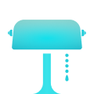

# Ambience

Brightness aware accessibility theme switching without coding.

[](https://travis-ci.org/tmergulhao/Ambience)
[](http://cocoapods.org/pods/Ambience)
[](http://cocoapods.org/pods/Ambience)
[](http://cocoapods.org/pods/Ambience)

## Example

To run the example project, clone the repo, and run `pod install` from the Example directory first.

## Installation

Ambience is available through [CocoaPods](http://cocoapods.org) and it's highly recomended you use it. To install it, simply add the following line to your Podfile:

```ruby
pod 'Ambience'
```

To enable it you have to call the Ambience singleton on your App Delegate like this:

```swift
import UIKit
import Ambience

@UIApplicationMain
class AppDelegate: UIResponder, UIApplicationDelegate {

    var window: UIWindow?

    func application(_ application: UIApplication, didFinishLaunchingWithOptions launchOptions: [UIApplicationLaunchOptionsKey: Any]?) -> Bool {

        _ = Ambience.shared

        return true
    }
}
```

Pretty standart stuff, right?

Ambience is so very convenient because it does a little bit of black magic under the hood. If you feel curious on how this work, scroll down to the **Nitty-Gritty** section.

## Built-in support

Ambience has built-in support for the background color for the following Interface Builder objects:

- View and all its children;
- Search, Navigation and Tab bars and all of its children;
- Text View, Button, and Label and all of its children.

There is also support for the text color for:

- Text View, Button, and Label and all of its children.

And there is also support for dark and light bar styles on:

- Search, Navigation and Tab bars and all of its children.

## Customizing a view

To customize a Interface Builder view, use the **Inspectable Properties** on the **Attributes Inspector**. Don't forget to turn **Ambience On** for that view.


Search, Navigation and Tab need to be turned on but their respective styles **are not customizable**.

## Custom Behaviors

It's also possible to define custom Ambience behavior on any Object that inherits from `NSObject`. Follow the instructions.

### Define an Override of the Ambience Method

In this example, we are implementing the current behavior for Search, Navigation and Tab bars. It guards the notification data for the current state as an `Ambience State` and sets the bar style accordingly.

```swift
public override func ambience(_ notification : Notification) {

    super.ambience(notification)

    guard let currentState = notification.userInfo?["currentState"] as? AmbienceState else { return }

    barStyle = currentState == .invert ? .black : .default
}
```

The notification user info dictionary also comes with the previous state so that more complex stateful behaviors can be implemented. It _may_ also come with an `animated` boolean attribute the is usually set to true and, at the first run, set to false so as not to have animation upon view appearance.

### Turning Ambience On

If your object is set on **Interface Builder**, use the **Attributes Inspector** and set to **On** the **Ambience** value.

In case you are setting this object programmatically, just set its `ambience` boolean value to `true` before placing it.

## Known issues

### Text View inside collection

If you are using a **Text View** inside a **Table View Cell** or a **Collection View Cell** and, in the process of dequeuing it you set its attributed text, beware. Right after assigning the new **Attributed Text** will need to write a mandatory single line of code to have **Ambience** work in the **Text View** properly.

Follow the example:

```swift

// Inside the respective Table View Controller

override func tableView(_ tableView: UITableView, cellForRowAt indexPath: IndexPath) -> UITableViewCell {

    let cell : TextTableCell! = tableView.dequeueReusableCell(withIdentifier: "Cell with text") as! TextTableCell

    cell.textView?.reinstateAmbience()

    return cell
}
```

It's simple, but mandatory.

I could have set some observers inside **Text View** so it could perform it on its own, but I won't do it at the risk of referencing cycles and swizzling madness.

## Nitty-Gritty

Yes. You need only a line of code to have Ambience work right out of the box. But there is a detail. For this to work, **Awake From Nib** is swizzled when you call **Ambience.shared**.

If you don't know what **swizzling** is, here goes a little explanation.

Swizzling two methods is nothing but swapping two method **addresses**. What do I mean by addess? Why did I do this?

I wanted every **UIView** to have access to **Ambience**. To have that, I had to do some configuration in the **UIView** before it reaches the devices screen. I chose to do this in the **Awake From Nib** method because it's guaranteed to be called right before the view hits the screen and on most of the **UIView** objects, such as **Navigation Bar**, **Search Bar** and **Tab Bar**, that have a a different lifecycle from a regular **UIView**.

```swift
static let classInit : Void = {

    swizzling(forClass: UIView.self, originalSelector: #selector(awakeFromNib), swizzledSelector: #selector(swizzled_awakeFromNib))
}()

@objc open func swizzled_awakeFromNib () {

    let name = String(describing:type(of: self))

    guard !NSObject.forbiddenNames.contains(name) else { return }

    swizzled_awakeFromNib()

    if ambience {
        _ = notificationManager
    }
}
```

The swizzling is going to happen to the address of **Awake From Nib** but will not affect inner calls. Let me explain. When **UI Kit** calls `view.awakeFromNib()` on a **UIView**, what is actually going to happen is `view.swizzled_awakeFromNib`. Nonetheless, when `swizzled_awakeFromNib` is called inside `swizzled_awakeFromNib`, it actually calls `awakeFromNib`, thus, giving us access to the default implementation.

In another words, this is a complicated way of adding this few lines to **every single UIView and any of its children**:

```swift
    if ambience {
        _ = notificationManager
    }
```

## Final note

If you have a nice idea or think that some edit of it might apply to a larger audience, feel free to create a **pull request**.

I'd like Apple to open the **Trait Environment** API so I may apply my **Trait Collection** extension and delete a few hundred lines of code. If you are there Apple: please, open it.

## Author

[tmergulhao](http://twitter.com/tmergulhao), me@tmergulhao.com

## License

Ambience is available under the MIT license. See the LICENSE file for more info.
